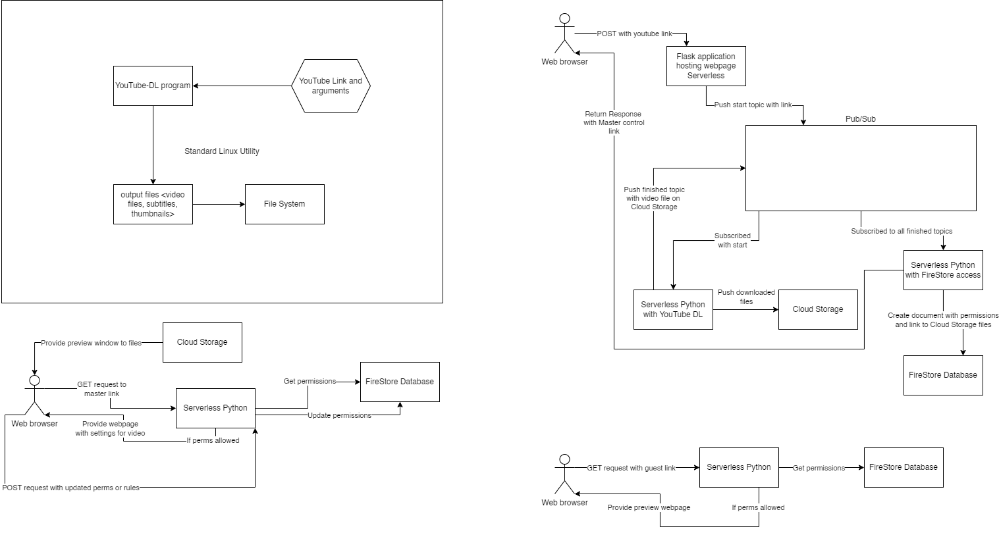

# ***Pull Den***

Cloud Computing Group Project - Video Archiving Application

## **Collaborators**

* Ariel Guerrero
* Shejan Shuza
* Hunter Long
* Viswa B
* Aaron G

## ***Description***

The service can allow a user to submit a YouTube video link to the service, and the service will create a
clone on Cloud Storage (including video metadata like descriptions, subtitles, thumbnails, etc.), the user
will then receive a “master link” that allows modification of the permissions to their sharable link to the
video on the service (count of usable clicks, duration, login requirements, etc.).

## ***Goals***

1. Construct APIs for pulling various parts of a YouTube video, including the video itself,
descriptions, subtitles, thumbnails, etc. based on yt-dlp
2. Understand and produce a Pub/Sub workflow for accepting user YouTube links for concurrent downloading
3. Format a Cloud Storage Bucket to support avoiding duplicates and storing potentially large data.
4. Integrate the service workflow to support Google’s BigQuery to gather statistics and analytics of
the service itself.

### ***Utilized Tools and Services***

1. Cloud Functions (API environment)
2. Pub/Sub (function organization and concurrency)
3. Cloud Storage (data storage)
4. BigQuery (analytics)
5. youtube-dl or yt-dlp (a fork of youtube-dl with better performance)
6. ffmpeg (used as part of youtube-dl, used for combining and converting media files, could be
used for creating separate versions of a video)
7. Python 3.9 (used as the basis of youtube-dl and used as the language of the APIs)

## ***Dataflow Diagram***

## ***Work Discord***

[Discord](https://discord.gg/6AmEpgpPtu)

## ***Test API***

The test API can be found [here](https://us-central1-cs4843-youtube-dl.cloudfunctions.net/test-youtube-video-download?link=), change the argument value of "link".

# Setting up Angular

## Install CLI

    npm install @angular/cli

## Create new project
